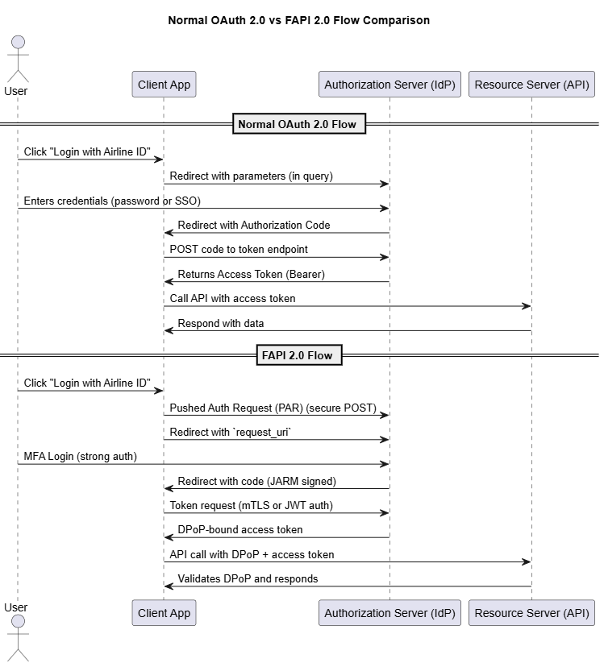

### [What is FAPI 2.0?](https://openid.net/specs/fapi-2_0-security-02.html)

FAPI 2.0 is a security profile defined by the OpenID Foundation to make OpenID Connect and OAuth 2.0 secure enough for financial and highly sensitive APIs.

✅ It’s not a new protocol, but a hardened configuration of OAuth 2.0 and OpenID Connect for high-stakes APIs (e.g., banking, insurance, identity verification, airline loyalty systems).

### Comparison: Normal OAuth 2.0 vs FAPI 2.0
| Aspect            | OAuth 2.0           | FAPI 2.0                              |
| ----------------- | ------------------- | ------------------------------------- |
| Token binding     | ❌ Optional or none  | ✅ Mandatory (DPoP or mTLS)            |
| Request signing   | ❌ Not enforced      | ✅ Mandatory (`request` JWT)           |
| Auth flow         | ✅ All flows allowed | ✅ Only code flow with PKCE            |
| Client auth       | 🔑 Basic Auth       | 🔐 mTLS or JWT assertion              |
| Endpoint security | ⚠️ Params in query  | ✅ Pushed Authorization Requests (PAR) |
| Token replay      | ⚠️ Possible         | ✅ Protected                           |


### Key Features in FAPI 2.0 (Security Profile)
| Feature                             | Description                                         |
| ----------------------------------- | --------------------------------------------------- |
| `request` object                    | Auth request is signed JWT – no tampering           |
| PKCE + JARM                         | Enhanced auth code flow with response signing       |
| mTLS / DPoP                         | Token bound to client – protects from theft         |
| Pushed Authorization Requests (PAR) | Prevents leaking request params                     |
| Strong Client Auth                  | No client secret; uses mTLS or JWT client assertion |
| Token Endpoint Restrictions         | Only supports code flow; implicit flows are banned  |
| Replay Protection                   | Ensures tokens and requests are one-time use        |


| Feature                                            | Purpose                                               |
| -------------------------------------------------- | ----------------------------------------------------- |
| **Pushed Authorization Request (PAR)**             | Avoids leaking sensitive auth parameters in URL       |
| **Request Object (JWT)**                           | Ensures signed and non-tampered authorization request |
| **JWT Secured Authorization Response Mode (JARM)** | Protects auth code in redirect                        |
| **DPoP (Demonstrating Proof-of-Possession)**       | Binds the access token to the client                  |
| **mTLS / Private Key JWT**                         | Strong client authentication (no shared secrets)      |


| OAuth Flow               | FAPI 2.0 Enhancements                |
| ------------------------ | ------------------------------------ |
| Auth Request via URL     | ✅ Pushed Authorization Request (PAR) |
| Unsigned Requests        | ✅ JWT-signed `request` objects       |
| Bearer Tokens            | ✅ DPoP or mTLS-bound tokens          |
| Weak Client Auth         | ✅ Private Key JWT or mTLS            |
| Risk of Token Replay     | ✅ Sender-constrained access tokens   |
| Basic Redirect with Code | ✅ JARM-signed responses              |


### Scenario:
 Intuitive Example
🏦 Scenario: Airline Loyalty Points Transfer via Travel App
A travel app allows a user to:
1. View frequent flyer points
2. Transfer miles to another airline partner
These APIs are sensitive — they affect real monetary value.

If the API uses basic OAuth 2.0, it's possible for:
- Phishing attacks (redirect to fake auth page)
- Token leakage (e.g., via browser history, logs)
- App impersonation

✅ With FAPI 2.0
The process becomes secure and bank-grade:
1. App is strongly authenticated using mTLS or private key JWT (no secret leakage).
2. Authorization request is:
    - Signed (request_object)
    - Bound to the client and redirect URI
    - Tamper-proof (so attackers can’t modify scopes)
3. Tokens are sender-constrained:
    - The access token is bound to the client (via DPoP or mTLS).
    - If stolen, the token can’t be reused by another app.
4. User authentication is high-assurance:
    - Enforced MFA
    - Authentication context (e.g., acr=urn:mfa)


### A. FAPI 2.0 Client Implementation in .NET (C#)

IdentityModel for OpenID Connect/OAuth 2.0 client

DPoP and private_key_jwt authentication to comply with FAPI 2.0

Assumes your identity provider (like custom IdentityServer) supports FAPI 2.0 features

### Why Azure AD or Entra External ID Isn’t FAPI-compliant (Yet)
- Entra External ID is focused on consumer and partner login (CIAM), not financial-grade or regulated API transaction-level security.

- FAPI is mainly targeted at Open Banking, insurance, and digital ID ecosystems, which typically use custom OIDC servers (like IdentityServer, Ping, or ForgeRock).

### Implement in .Net
#### Nuget:

```
dotnet add package IdentityModel
dotnet add package IdentityModel.OidcClient
```

### C# FAPI 2.0 Secure Auth Flow (using private_key_jwt and DPoP)
```
using IdentityModel.Client;
using IdentityModel;
using System.Security.Cryptography;
using System.Net.Http;
using System.Text.Json;
using System.Text;

var clientId = "travel-agency-portal";
var redirectUri = "https://travelagency.com/callback";

// Step 1: Discover OpenID provider metadata
var disco = await HttpClientDiscoveryExtensions.GetDiscoveryDocumentAsync("https://idp.airline.com");
if (disco.IsError) throw new Exception(disco.Error);

// Step 2: Generate DPoP Key
var dpopKey = CryptoHelper.CreateRsaSecurityKey();

// Step 3: Create Authorization Request with PAR
var client = new HttpClient();

var authRequest = new RequestUrl(disco.PushedAuthorizationRequestEndpoint).Create(new Parameters
{
    { "client_id", clientId },
    { "redirect_uri", redirectUri },
    { "response_type", "code" },
    { "scope", "openid profile airline_api" },
    { "state", CryptoRandom.CreateUniqueId() },
    { "nonce", CryptoRandom.CreateUniqueId() }
});

// Create DPoP header
var dpopProof = DPoPProof.Create(disco.AuthorizationEndpoint, HttpMethod.Get.Method, dpopKey);

// Send PAR request
var parRequest = new HttpRequestMessage(HttpMethod.Post, disco.PushedAuthorizationRequestEndpoint);
parRequest.Headers.Add("DPoP", dpopProof);
parRequest.Content = new FormUrlEncodedContent(authRequest);

// Assume it returns request_uri
var parResponse = await client.SendAsync(parRequest);
var content = await parResponse.Content.ReadAsStringAsync();
var json = JsonDocument.Parse(content);
var requestUri = json.RootElement.GetProperty("request_uri").GetString();

// Step 4: Redirect User
var authorizationUrl = disco.AuthorizationEndpoint + $"?request_uri={requestUri}";
Console.WriteLine("Redirect to: " + authorizationUrl);
```

### B. IdentityServer FAPI 2.0 Server Setup (OpenID Provider)
Note: If you're using IdentityServer (commercial), you can enable FAPI 2.0 profiles with:
```
services.AddIdentityServer(options =>
{
    options.Authentication.CookieLifetime = TimeSpan.FromMinutes(30);
})
.AddInMemoryClients(Clients.Get())
.AddInMemoryApiScopes(ApiScopes.Get())
.AddInMemoryIdentityResources(Resources.Get())
.AddDeveloperSigningCredential()
.AddFapiDefaults(); // Enables FAPI 2.0 secure defaults
```

### Client Config (Private Key JWT + DPoP)
```
new Client
{
    ClientId = "travel-agency-portal",
    AllowedGrantTypes = GrantTypes.Code,
    RedirectUris = { "https://travelagency.com/callback" },
    RequirePkce = true,
    RequireClientSecret = false,
    ClientSecrets = null, // Using JWT instead
    TokenEndpointAuthenticationMethod = "private_key_jwt",
    AllowedScopes = { "openid", "profile", "airline_api" },
    RequireRequestObject = true,
    AllowedIdentityTokenSigningAlgorithms = { "PS256" },
    AccessTokenType = AccessTokenType.Reference,
    AccessTokenLifetime = 600
}

```